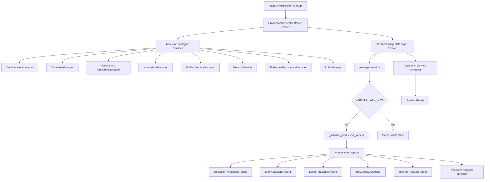
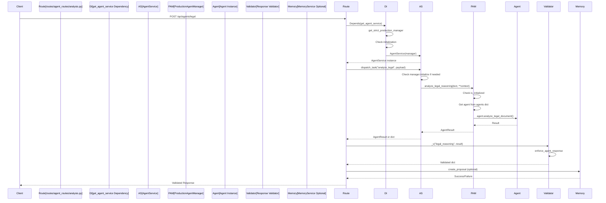
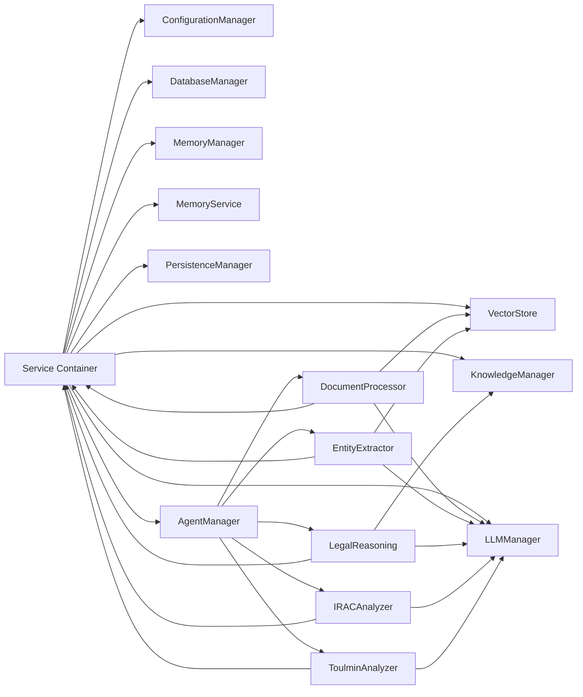
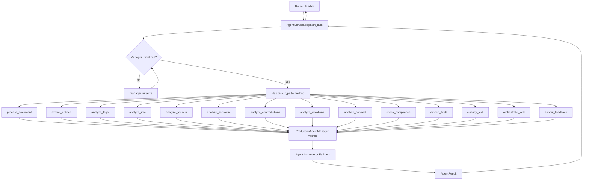
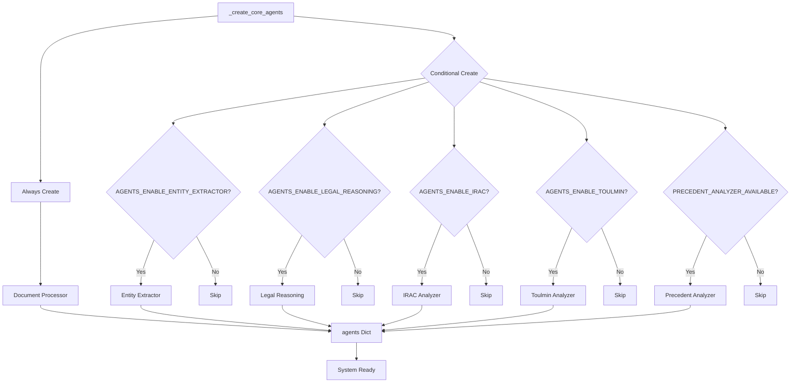

# Service Dependency Map - Analysis Routes Pipeline

## Overview

This document provides a visual representation of the service dependency chain and initialization order for the analysis routes pipeline.

## Service Initialization Order

## Request Flow - Analysis Route

## Service Container Dependency Graph

## Task Dispatch Flow

## Agent Creation Flow

## Missing Agent Implementations

The following agents are referenced in routes but NOT created in `_create_core_agents()`:

- **SEMANTIC_ANALYZER**: Implemented as method `analyze_semantic()` in OperationsMixin, checks for agent instance but has degradation notice fallback
- **CONTRADICTION_DETECTOR**: Implemented as method `analyze_contradictions()` in OperationsMixin, uses heuristic fallback
- **VIOLATION_REVIEW**: Implemented as method `analyze_violations()` in OperationsMixin, uses heuristic fallback
- **CLASSIFIER**: Implemented as method `classify_text()` in OperationsMixin, uses transformers with keyword fallback
- **EMBEDDER**: Implemented as method `embed_texts()` in OperationsMixin, uses sentence-transformers with hash fallback
- **ORCHESTRATOR**: Implemented as method `orchestrate()` in OperationsMixin, uses DAG orchestrator if available

**Note:** These are implemented as **manager methods** rather than separate agent instances, which is a valid pattern but inconsistent with the agent registry approach.
